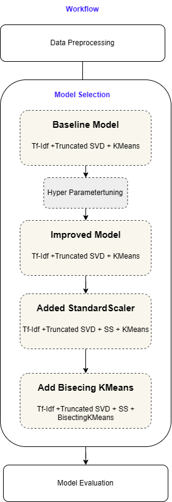
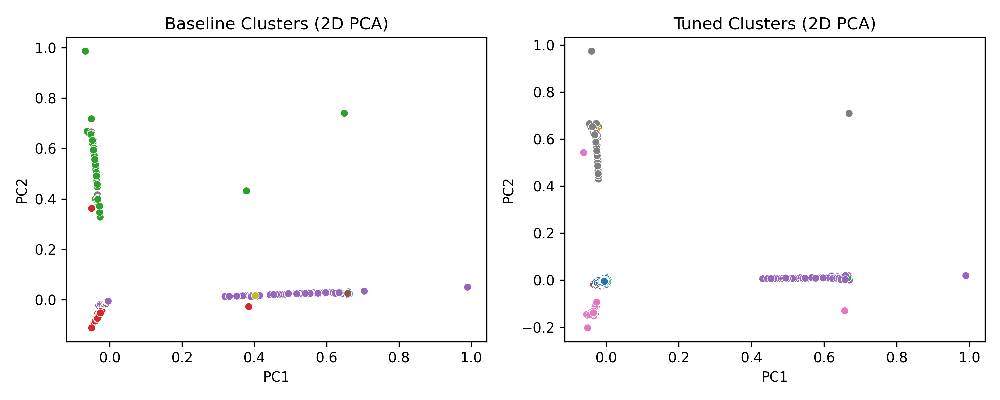
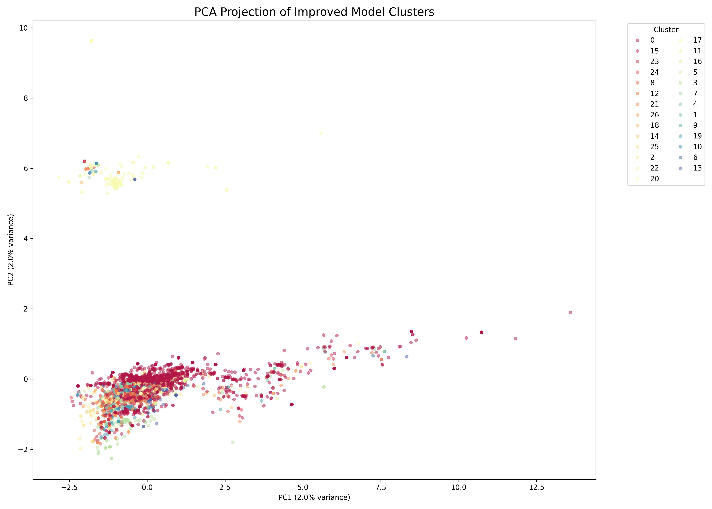
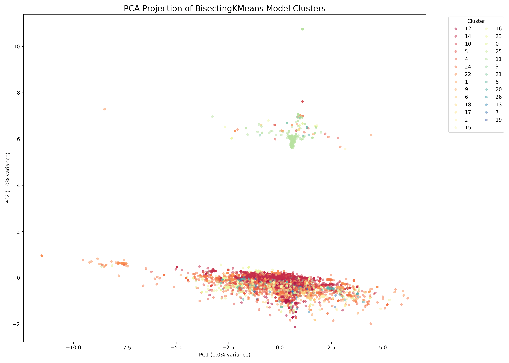

## News Clustering: A Lexical Approach

This project explores the unsupervised categorization of news headlines using various NLP pipelines. The goal was to move from a generic baseline to a model capable of breaking down large, dense "news blobs" into meaningful sub-topics.

### Pipeline

1. **Baseline Model**: Standard **K-Means** with default TF-IDF vectorization. This served as the primary benchmark for cluster separation and density.
2. **Tuned & Improved Models**: Optimized the TF-IDF "lens" by adjusting `max_df` (to ignore corpus-specific stop words) and implementing **Dimensionality Reduction (SVD)** and **Standard Scaling**.
* *Observation*: While these yielded "mathematically perfect" Silhouette scores (), they resulted in highly imbalanced clusters where the majority of data remained in a single "General News" group. 
3. **Bisecting K-Means (BiKMeans)**: Implemented a top-down hierarchical clustering approach.
* *Observation*: Even though the Silhouette score dropped to , this model successfully "shattered" the primary cluster, providing a much more even and semantically useful distribution of news topics.

### Models Performance Comparison

The following table tracks the trade-off between mathematical tightness and cluster distribution:

| Metric | Baseline | Tuned | Improved Tuned | **BiKMeans** |
| --- | --- | --- | --- | --- |
| **Silhouette Score** | 0.554 | 0.783 | **0.800** | 0.562 |
| **Calinski-Harabasz** | 1227.8 | **2979.2** | 2802.1 | 620.8 |
| **Davies–Bouldin** | 0.643 | 0.471 | **0.316** | 2.396 |

---

### Tech Stack

* **Language**: Python
* **NLP**: Scikit-Learn (TF-IDF, SVD)
* **Clustering**: KMeans, BisectingKMeans
* **Visualization**: PCA (2D/3D), Matplotlib, Seaborn

---

### Model Selection & The "Optimization Paradox"

While the **Improved K-Means** model achieved the highest mathematical scores (, ), it suffered from the **"Majority Cluster Problem."** In this state, the model successfully isolated small niche topics (outliers) but failed to segment the core 90% of the dataset, leaving 40,000+ headlines in a single, uninformative "General News" blob.

  
  

I  selected **Bisecting K-Means** as the production model for the following reasons:

* **Semantic Granularity:** By utilizing a hierarchical, top-down splitting strategy, BiKMeans forced the "General News" mass to fracture into distinct sub-topics (e.g., separating "Regional Politics" from "National Policy").
* **Balance vs. Separation:** A lower Silhouette score () in exchange for a lower **Gini Coefficient** (a measure of cluster size inequality).
* **Real-World Utility:** A model that provides 27 actionable, balanced categories is significantly more valuable for downstream tasks (like automated tagging or recommendation engines) than a model that provides one giant "Catch-all" category.

---

### Summary

| Model | Strategy | Primary Strength | Verdict |
| --- | --- | --- | --- |
| **K-Means Baseline** | Flat Clustering | Baseline performance | Weak distribution |
| **Improved Tuned** | SVD + Scaling | **Highest Math Scores** | Failed to segment core mass |
| **Bisecting K-Means** | Hierarchical Split | **Best Topic Discovery** | **Selected Model** |

---

